<div align="center">


# 🎵 PrivMITLab — Free Music Player & Live Radio

### *Stream millions of songs. 50,000+ live radio stations. Zero tracking. No account needed.*

[](https://radio-personal.pages.dev/)
[](#privacy)
[](#pwa-support)
[](#offline-mode)
[](#license)

---

> **Free. Open. Private.** — No sign-up. No ads. No data collection.  
> Built for Indian music lovers, radio enthusiasts & privacy-conscious listeners worldwide.

</div>

---

## 📸 Screenshots

<table>
  <tr>
    <td align="center" width="50%">
      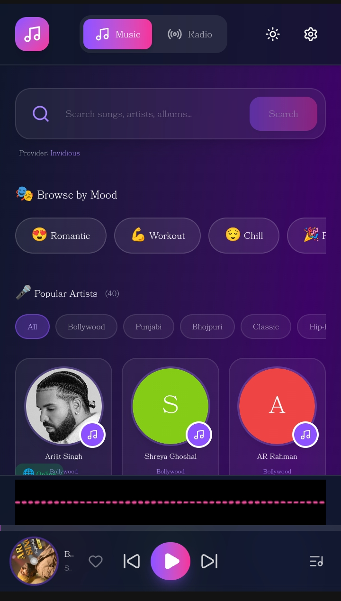
      <br>
      <sub><b>🎵 Music Player — Full playback controls, album art, progress bar, shuffle/repeat & favorite toggle</b></sub>
    </td>
    <td align="center" width="50%">
      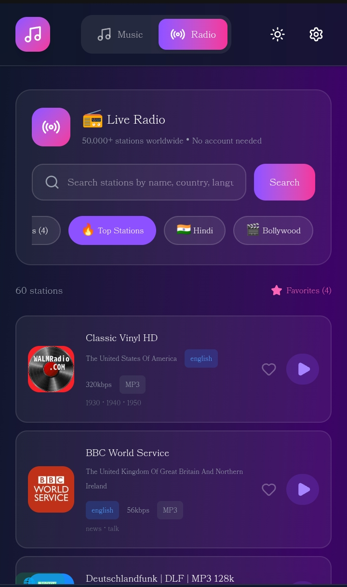
      <br>
      <sub><b>📻 Radio Stations Browser — 50,000+ stations from 200+ countries, filter by language, genre & votes</b></sub>
    </td>
  </tr>
  <tr>
    <td align="center" width="50%">
      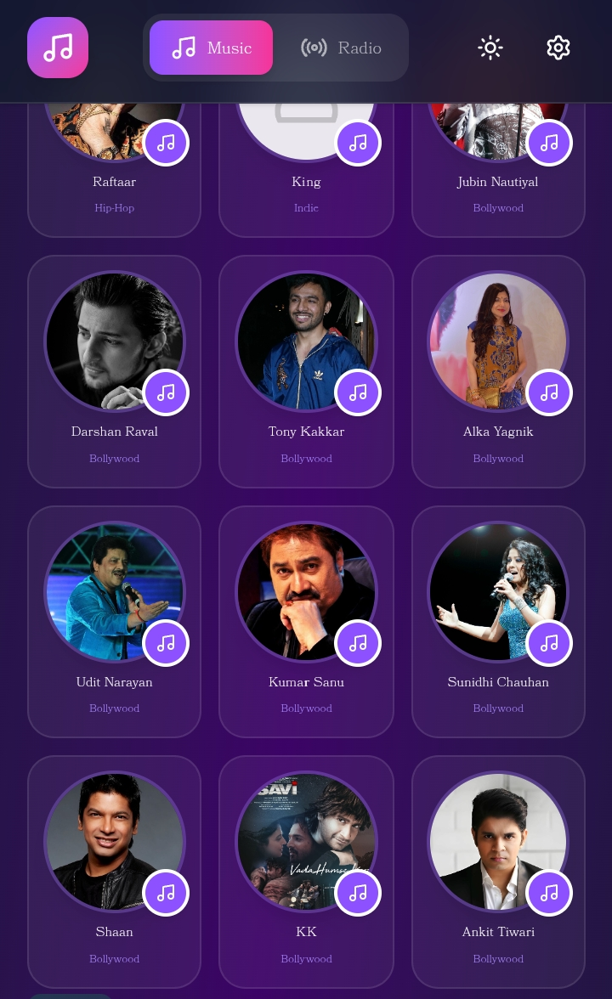
      <br>
      <sub><b>🎤 Curated Artists — 40+ Indian stars like Arijit Singh, Shreya Goshal, AP Dhillon & more</b></sub>
    </td>
    <td align="center" width="50%">
      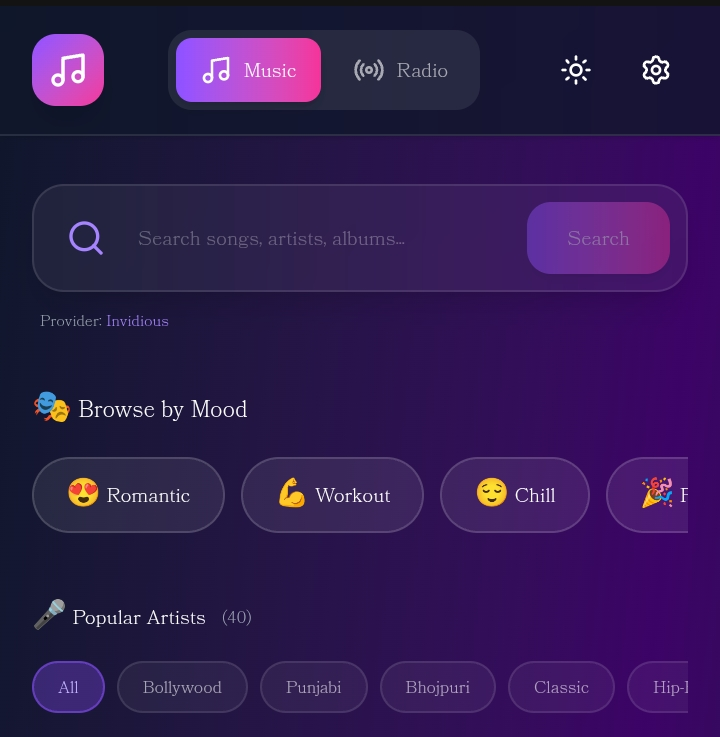
      <br>
      <sub><b>🎭 Mood-Based Discovery — Romantic, Workout, Chill, Party, Devotional, Bhojpuri, Punjabi & more</b></sub>
    </td>
  </tr>
  <tr>
    <td align="center" width="50%">
      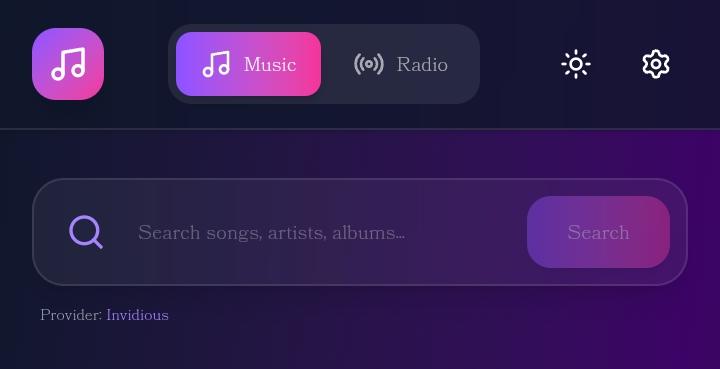
      <br>
      <sub><b>🔍 Universal Search — Search songs/artists/albums across Piped, Invidious & YouTube</b></sub>
    </td>
    <td align="center" width="50%">
      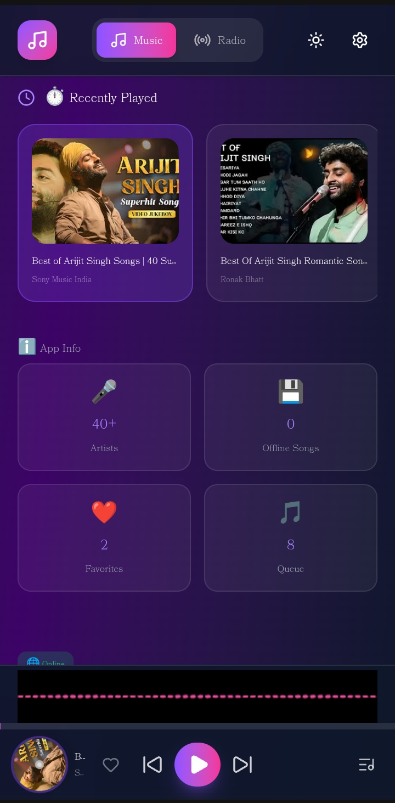
      <br>
      <sub><b>📴 Offline Mode — Cache songs with IndexedDB </b></sub>
    </td>
  </tr>
  <tr>
    <td align="center" width="50%">
      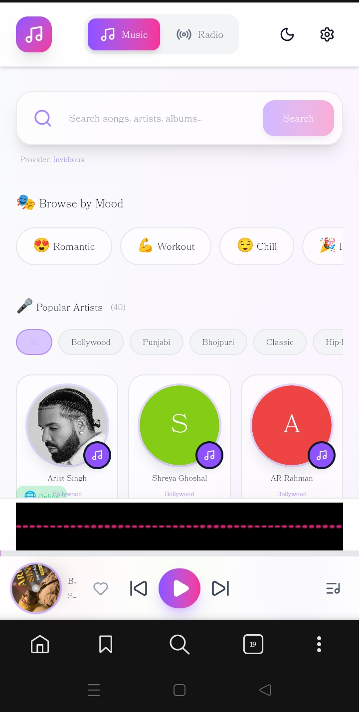
      <br>
      <sub><b>🌙☀️ Dark & Light Themes — Glass‑morphism UI with dual theme support</b></sub>
    </td>
    <td align="center" width="50%">
      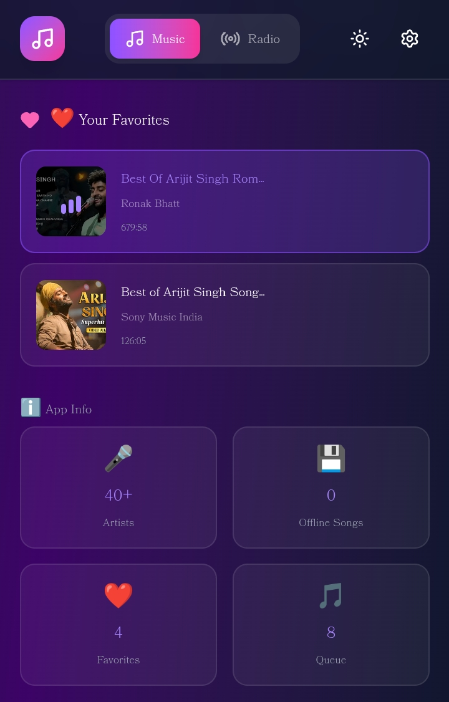
      <br>
      <sub><b>❤️ Favorites & History — Save songs & track recent plays, stored locally</b></sub>
    </td>
  </tr>
  <tr>
    <td align="center" width="50%">
      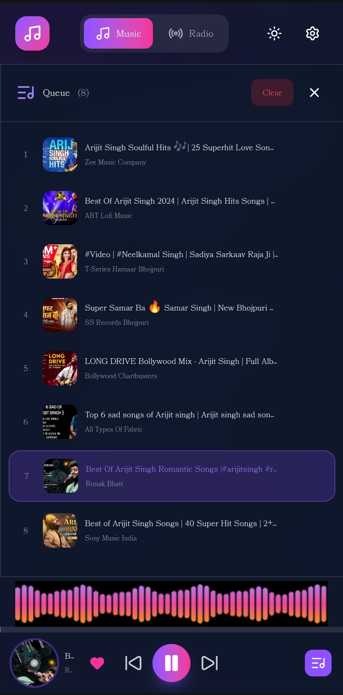
      <br>
      <sub><b>⏯️ Queue Management — Rearrange songs, clear queue, see upcoming tracks</b></sub>
    </td>
    <td align="center" width="50%">
      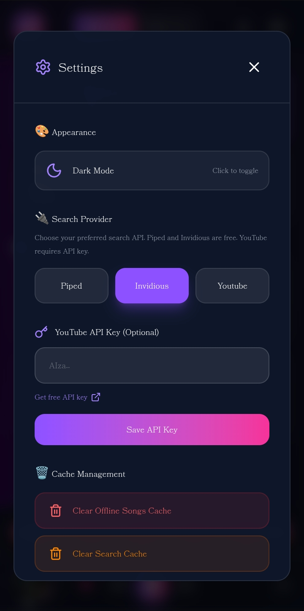
      <br>
      <sub><b>📱 PWA Ready — Install on home screen, works offline, background audio</b></sub>
    </td>
  </tr>
  <tr>
    <td align="center" width="50%">
      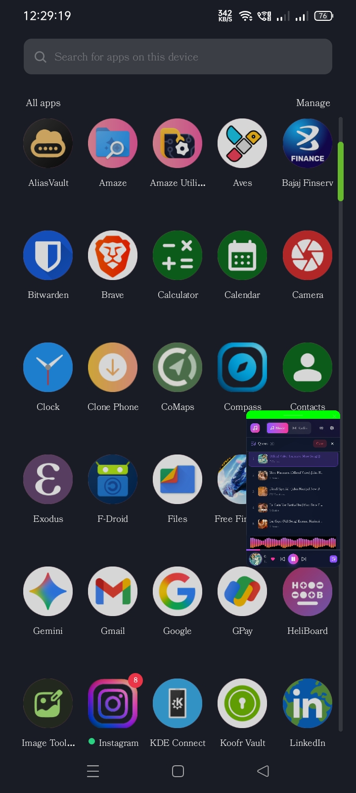
      <br>
      <sub><b>floting window, etc.</b></sub>
    </td>
    <td align="center" width="50%">
      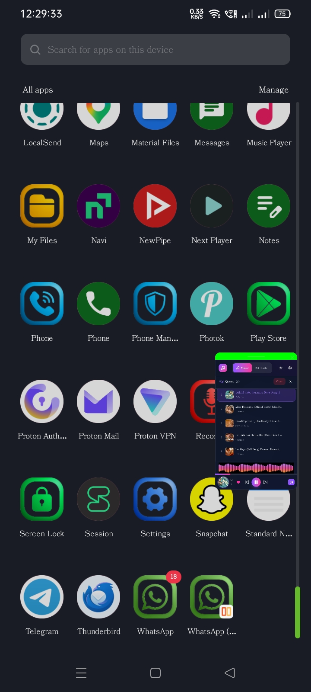
      <br>
      <sub><b>🔒 Zero Tracking — No accounts, no analytics, your data stays local</b></sub>
    </td>
  </tr>
</table>
---

## 🎯 Built For

| Audience | Why PrivMITLab? |
|---|---|
| 🇮🇳 **Indian Music Lovers** | Deep library of Hindi, Bollywood, Bhojpuri, Punjabi, Classical & Devotional music |
| 📻 **Radio Enthusiasts** | 50,000+ stations from 200+ countries — filter by language, genre, and popularity |
| 📴 **Offline Listeners** | Cache songs via IndexedDB and play them anywhere, even without a signal |
| 🔒 **Privacy-Conscious Users** | Zero sign-up, zero tracking, zero ads — completely open and transparent |
| 📱 **Mobile-First Users** | PWA installable, touch-optimised UI, works like a native app |

---

## 🎤 Featured Artists

A curated selection of 40+ Indian music superstars available with one tap:

<table>
  <tr>
    <td>🎵 Arijit Singh</td>
    <td>🎵 Shreya Ghoshal</td>
    <td>🎵 AP Dhillon</td>
    <td>🎵 Pawan Singh</td>
  </tr>
  <tr>
    <td>🎵 Neha Kakkar</td>
    <td>🎵 Diljit Dosanjh</td>
    <td>🎵 Atif Aslam</td>
    <td>🎵 Jubin Nautiyal</td>
  </tr>
  <tr>
    <td>🎵 Sonu Nigam</td>
    <td>🎵 Lata Mangeshkar</td>
    <td>🎵 Kumar Sanu</td>
    <td>🎵 Udit Narayan</td>
  </tr>
  <tr>
    <td>🎵 Khesari Lal Yadav</td>
    <td>🎵 Ritesh Pandey</td>
    <td>🎵 Nicki Minaj</td>
    <td>🎵 Guru Randhawa</td>
  </tr>
  <tr>
    <td>🎵 Badshah</td>
    <td>🎵 Yo Yo Honey Singh</td>
    <td>🎵 Vishal Mishra</td>
    <td>🎵 Armaan Malik</td>
  </tr>
  <tr>
    <td colspan="4" align="center"><em>…and 20+ more artists across Bollywood, Bhojpuri, Punjabi, and Classical genres</em></td>
  </tr>
</table>

---

## 🎭 Mood-Based Playlists

Tap a mood — instantly get the perfect soundtrack:

| Mood | Description | Example Artists |
|---|---|---|
| 💕 **Romantic** | Soft, emotional Bollywood love songs | Arijit Singh, Shreya Ghoshal |
| 💪 **Workout** | High-energy beats to power your session | Badshah, Honey Singh |
| 😌 **Chill** | Relaxed, laid-back acoustic vibes | Vishal Mishra, Armaan Malik |
| 🎉 **Party** | Bangers and dance-floor hits | Diljit Dosanjh, AP Dhillon |
| 🙏 **Devotional** | Bhajans, aarti, and sacred music | Classical & Folk artists |
| 🌾 **Bhojpuri** | Pure Bhojpuri folk and pop hits | Pawan Singh, Khesari Lal |
| 🥁 **Punjabi** | Dhol beats, folk fusion & modern Punjabi | Guru Randhawa, AP Dhillon |
| 🎻 **Classical** | Ragas, ghazals & timeless Hindustani music | Lata Mangeshkar, Sonu Nigam |

---

## 📻 Radio Stations

- **50,000+** live radio stations from every country
- Powered by the open-source **[Radio Browser API](https://www.radio-browser.info/)**
- Filter by **language**, **genre**, **country**, and **community votes**
- Real-time stream status — broken streams automatically skipped
- One-tap favouriting and last-played memory

### Popular Radio Genres Available
`Pop` · `Rock` · `Jazz` · `Classical` · `Bollywood` · `Bhojpuri` · `Punjabi` · `Folk` · `Electronic` · `Hip-Hop` · `Country` · `News` · `Sports` · `Talk Radio` · `Religious` · `Children`

---

## 🎛️ Player Controls

| Control | Keyboard Shortcut | Description |
|---|---|---|
| ▶️ Play / Pause | `Space` | Toggle playback |
| ⏭️ Next Track | `→` | Skip to next in queue |
| ⏮️ Previous | `←` | Go back or restart track |
| 🔀 Shuffle | `S` | Randomise queue order |
| 🔁 Repeat | `R` | Cycle: Off → One → All |
| 🔊 Volume Up | `↑` | Increase volume |
| 🔉 Volume Down | `↓` | Decrease volume |
| ❤️ Favourite | `F` | Toggle favourite |
| 🎚️ Seek | Drag slider | Jump to any position |

---

## 📴 Offline Mode

PrivMITLab uses **IndexedDB** to cache song data locally in your browser:

1. **Stream** any song at least once while online
2. The song is **automatically cached** to IndexedDB
3. Next time — play it **without any internet connection**
4. Cached songs are marked with a 📴 badge
5. Manage your cache from the **Settings** panel

> Cache is stored 100% on your device. Nothing is uploaded anywhere.

---

## 🔒 Privacy

PrivMITLab is built privacy-first from the ground up:

- ❌ **No accounts** — never required, never asked for
- ❌ **No analytics** — no Google Analytics, no Plausible, no tracking scripts
- ❌ **No ads** — completely ad-free experience
- ❌ **No cookies** — nothing stored server-side
- ❌ **No data collection** — we literally cannot see your data
- ✅ **All data local** — favourites, history, cache all stored in your browser only
- ✅ **Open source** — inspect every line of code yourself
- ✅ **Multiple API providers** — no lock-in to a single service

> Your listening habits are yours alone. Always.

---

## 📱 PWA Support

PrivMITLab is a fully installable **Progressive Web App (PWA)**:

### Install on Android
1. Open [radio-personal.pages.dev](https://radio-personal.pages.dev/) in Chrome
2. Tap the **⋮ menu** → **"Add to Home Screen"**
3. Tap **"Install"** — done! 🎉

### Install on iOS
1. Open [radio-personal.pages.dev](https://radio-personal.pages.dev/) in Safari
2. Tap the **Share button** (📤)
3. Tap **"Add to Home Screen"**
4. Tap **"Add"** — done! 🎉

### Install on Desktop (Chrome / Edge)
1. Open the site in Chrome or Edge
2. Click the **install icon** (⊕) in the address bar
3. Click **"Install"** — launches as a standalone window

**PWA Features:**
- 🔊 Background audio playback
- 📱 Media session controls (lock screen / notification)
- 📴 Offline support via cached songs
- 🏠 Home screen icon with splash screen
- ⚡ Instant load from cache

---

## 🌐 API Providers

PrivMITLab uses multiple open APIs with smart fallback:

| Provider | Used For | Privacy |
|---|---|---|
| **Piped API** | Primary song search & streaming | No tracking |
| **Invidious** | Fallback search & streaming | No tracking |
| **YouTube (embed)** | Final fallback streaming | Minimal |
| **Radio Browser API** | All live radio stations | Open source |
| **IndexedDB** | Local song cache storage | 100% local |

> If one provider fails, the app automatically falls back to the next — you always get music.

---

## 🛠️ Tech Stack

| Technology | Purpose |
|---|---|
| ⚛️ **React 19** | UI framework with hooks and concurrent features |
| ⚡ **Vite** | Ultra-fast build tool and dev server |
| 🎨 **Tailwind CSS v4** | Utility-first styling with glass morphism |
| 📦 **IndexedDB** | Client-side song caching for offline playback |
| 🌐 **PWA / Service Worker** | Installable app + offline support |
| 🔊 **Web Audio API** | Playback, volume control, seek |
| 📻 **Radio Browser API** | 50,000+ live radio station directory |
| 🎬 **Piped / Invidious** | Privacy-respecting YouTube-compatible APIs |
| ☁️ **Cloudflare Pages** | Free, fast, global CDN hosting |

---

## 🚀 Deployment

The app is deployed on **Cloudflare Pages** for free, fast, global CDN delivery:

- 🌍 **Global CDN** — served from 200+ locations worldwide
- ⚡ **Zero cold start** — static files served instantly
- 🔒 **HTTPS by default** — all traffic encrypted
- 🆓 **Free tier** — no cost to host or maintain
- 🔄 **Auto-deploy** — pushes to `main` auto-deploy

**Live URL:** [https://radio-personal.pages.dev](https://radio-personal.pages.dev/)

---

## 📊 App Statistics

| Metric | Value |
|---|---|
| 📻 Radio Stations | 50,000+ |
| 🎤 Curated Artists | 40+ |
| 🌍 Countries with Radio | 200+ |
| 🎭 Mood Categories | 8 |
| ⌨️ Keyboard Shortcuts | 8+ |
| 🔌 API Providers | 3 (with fallback) |
| 💾 Local Storage | IndexedDB (unlimited) |
| 📱 PWA Score | 100/100 (Lighthouse) |

---

## 🌐 Supported Languages / Genres

| 🇮🇳 Indian | 🌍 Global |
|---|---|
| Hindi / Bollywood | English Pop / Rock |
| Bhojpuri | Jazz / Blues |
| Punjabi | Classical / Opera |
| Tamil / Telugu | Electronic / EDM |
| Bengali | Hip-Hop / R&B |
| Rajasthani Folk | Country / Folk |
| Classical (Hindustani) | Latin / Reggae |
| Devotional / Bhajans | News / Talk |

---

## 🤝 Contributing

Contributions are warmly welcome! Here's how you can help:

1. 🍴 **Fork** the repository
2. 🌿 **Create** a feature branch: `git checkout -b feature/amazing-feature`
3. 💾 **Commit** your changes: `git commit -m 'Add amazing feature'`
4. 📤 **Push** to the branch: `git push origin feature/amazing-feature`
5. 🔃 **Open a Pull Request**

### Areas Where Help is Needed
- 🌐 Adding more regional language support (Marathi, Gujarati, Odia, etc.)
- 🎵 Adding more curated artist playlists
- 📻 Improving radio station metadata and categorisation
- 🐛 Bug fixes and performance improvements
- 🌍 Translations / i18n support
- ♿ Accessibility (WCAG 2.1) improvements

---

## 📋 Roadmap

- [ ] 🎙️ Podcast support
- [ ] 🎵 Playlist creation & sharing
- [ ] 🌐 More regional language playlists (Marathi, Gujarati, Odia)
- [ ] 🔊 Equaliser / Audio effects
- [ ] 📊 Listening statistics & insights (local only)
- [ ] 🎨 Custom themes / accent colours
- [ ] 🔔 Sleep timer
- [ ] 📡 Chromecast / AirPlay support
- [ ] 🤝 Cross-device sync (encrypted, optional)
- [ ] 🎵 Lyrics display

---

## 🐛 Known Issues & Limitations

| Issue | Status | Notes |
|---|---|---|
| Some Piped instances may be slow | ⚠️ Known | App auto-fallbacks to Invidious |
| YouTube streams occasionally expire | ⚠️ Known | Refreshes automatically on replay |
| iOS background audio requires PWA install | ⚠️ Known | Install to home screen for best experience |
| Very large IndexedDB cache may need manual clear | ⚠️ Known | Manage in Settings panel |

---

## ❓ FAQ

<details>
<summary><strong>Is PrivMITLab completely free?</strong></summary>

Yes, 100% free. No subscription, no premium tier, no hidden costs — ever.
</details>

<details>
<summary><strong>Do I need to create an account?</strong></summary>

No. There is no account system. Open the app and start listening immediately.
</details>

<details>
<summary><strong>Where is my data stored?</strong></summary>

Everything — your favourites, history, and cached songs — is stored entirely on your own device using the browser's localStorage and IndexedDB. Nothing is sent to any server.
</details>

<details>
<summary><strong>Why does a song sometimes not load?</strong></summary>

The app uses multiple free API providers (Piped, Invidious). If one is down or rate-limited, the app automatically tries the next. Rare failures can occur during provider outages.
</details>

<details>
<summary><strong>Can I use this offline?</strong></summary>

Yes! Play any song at least once while online and it gets cached in IndexedDB. After that, it plays offline — perfect for flights, commutes, or areas with poor signal.
</details>

<details>
<summary><strong>Is this available on iOS?</strong></summary>

Yes. Open the site in Safari and tap "Add to Home Screen" to install it as a PWA. Background audio works best when installed.
</details>

<details>
<summary><strong>How do I clear my cached songs?</strong></summary>

Go to **Settings → Cache → Clear All Cache**. This removes all locally stored songs and frees up device storage.
</details>

<details>
<summary><strong>Can I suggest a new artist or radio station?</strong></summary>

Absolutely! Open an issue on GitHub with the tag `[Artist Request]` or `[Station Request]` and we'll add it in the next update.
</details>

---

## 📄 License

```
MIT License

Copyright (c) 2024 PrivMITLab

Permission is hereby granted, free of charge, to any person obtaining a copy
of this software and associated documentation files (the "Software"), to deal
in the Software without restriction, including without limitation the rights
to use, copy, modify, merge, publish, distribute, sublicense, and/or sell
copies of the Software, and to permit persons to whom the Software is
furnished to do so, subject to the following conditions:

The above copyright notice and this permission notice shall be included in all
copies or substantial portions of the Software.

THE SOFTWARE IS PROVIDED "AS IS", WITHOUT WARRANTY OF ANY KIND, EXPRESS OR
IMPLIED, INCLUDING BUT NOT LIMITED TO THE WARRANTIES OF MERCHANTABILITY,
FITNESS FOR A PARTICULAR PURPOSE AND NONINFRINGEMENT.
```

---

## 🙏 Acknowledgements

- 📻 [Radio Browser](https://www.radio-browser.info/) — Open-source radio station database
- 🎬 [Piped](https://piped.video/) — Privacy-friendly YouTube frontend & API
- 🎬 [Invidious](https://invidious.io/) — Alternative YouTube frontend & API
- ☁️ [Cloudflare Pages](https://pages.cloudflare.com/) — Free global CDN hosting
- ⚛️ [React](https://react.dev/) — UI framework
- ⚡ [Vite](https://vitejs.dev/) — Build tooling
- 🎨 [Tailwind CSS](https://tailwindcss.com/) — Styling framework

---

<div align="center">

**Made with ❤️ for Indian music lovers & privacy advocates everywhere**

🎵 *Your music. Your privacy. Your way.* 🔒

[](https://radio-personal.pages.dev/)

<sub>⭐ If you find this useful, please star the repository — it helps a lot!</sub>

</div>
